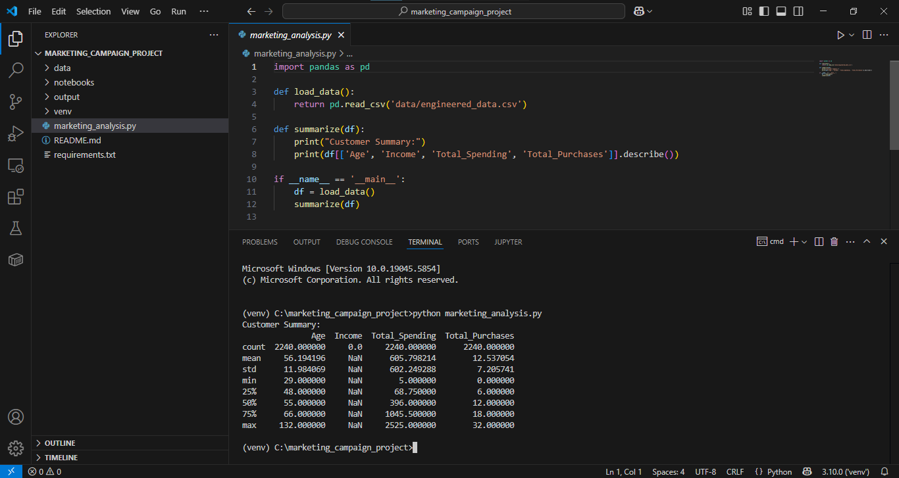

# 🧠 Marketing Campaign Project
## Analyze customer demographics and marketing campaign data to understand behavioral trends and optimize acquisition strategies.
---

## Overview
This project analyzes customer demographics and marketing campaign performance to understand customer acquisition.

## Project Directory Structure:
```
marketing_campaign_project/
├── data/
│   └── marketing_data.csv         # Your dataset
├── notebooks/
│   └── 01_eda_cleaning.ipynb      # EDA & cleaning
│   └── 02_feature_engineering.ipynb
│   └── 03_visualizations.ipynb
│   └── 04_hypothesis_testing.ipynb
├── output/
│   └── plots/                     # Boxplots, histograms, etc.
│   └── reports/                   # Final summaries or insights
├── marketing_analysis.py         # Main script if needed
├── README.md
└── requirements.txt              # Required packages
```
---

## Structure
- **EDA:** Explore and clean the dataset.
- **Feature Engineering:** Derive new meaningful features.
- **Visualizations:** Plot distributions and correlations.
- **Hypothesis Testing:** Test assumptions about customer behavior.

---

# How to Run

## Install dependencies:
``` pip install -r requirements.txt ```

## Confirm Python version Installed
``` py -0 ```

## Create Virtual Environment with Python suitable version (3.10.0 in my case)
``` py -3.10 -m venv venv ```

## Activate (venv) Enviornment
### 1. Temporarily allow script execution in powershell terminal in VS Code
``` Set-ExecutionPolicy -ExecutionPolicy RemoteSigned -Scope Process ```

### 2. Activate (venv) Enviornment
``` .\venv\Scripts\Activate ```

## Use Jupyter to open the notebooks:
``` jupyter notebook ```

### 1. Run the following notebooks in order:
```
    >> 01_eda_cleaning.ipynb
    >> 02_feature_engineering.ipynb
    >> 03_visualizations.ipynb
    >> 04_hypothesis_testing.ipynb
```
### 2. Run the cell for the result 
### 3. ### Results:
```
Plots in output/plots/
Reports in output/reports/
```

## Alternate Option (VS Code)

### 1. Open /notebooks directory and select the 01_eda_cleaning.ipynb file. 
### 2. In select kernel section chose the python 3.10.0 venv enviorment from dropdown options.
### 3. Run the selected cell to see output.
### 4. Do the same for 
```
    >> 02_feature_engineering.ipynb
    >> 03_visualizations.ipynb
    >> 04_hypothesis_testing.ipynb
```
### Results:
```
Plots in output/plots/
Reports in output/reports/
```
---

## 📊 Output Files
### Plots:
```
income_boxplot.png
age_histogram.png
correlation_heatmap.png
marital_status_barplot.png
education_barplot.png
```
### Reports:
```
summary_statistics.csv
hypothesis_results.txt
```
---

## 🔧 Notes
```
.ipynb_checkpoints/ folder contains autosaved drafts.
marketing_analysis.py (optional): Use if you want to automate the workflow using a script.
```
---

## 📦 Requirements
```
Python 3.10+
pandas, matplotlib, seaborn, scipy, jupyter
```

---

## Final Project Directory Structure after running the .ipynb Files
```
marketing_campaign_project/
├── data/
│   ├── marketing_data.csv            # Original dataset
│   ├── cleaned_data.csv              # Cleaned after 01_eda_cleaning.ipynb
│   └── engineered_data.csv           # Output of 02_feature_engineering.ipynb
├── notebooks/
│   ├── 01_eda_cleaning.ipynb         # EDA & cleaning
│   ├── 02_feature_engineering.ipynb
│   ├── 03_visualizations.ipynb
│   ├── 04_hypothesis_testing.ipynb
│   └── .ipynb_checkpoints/           # Auto-saved notebook versions
├── output/
│   ├── plots/                        # Contains:
│   │   ├── income_boxplot.png
│   │   ├── age_histogram.png
│   │   ├── correlation_heatmap.png
│   │   ├── marital_status_barplot.png
│   │   └── education_barplot.png
│   └── reports/
│       ├── summary_statistics.csv
│       └── hypothesis_results.txt
├── marketing_analysis.py             # Optional main driver script
├── README.md
└── requirements.txt                  # Package list
```

---

## Sample Output Plots

### Income Distribution


### Age Histogram


### Hypothesis Testing Results


### Correlation Heatmap


### Education Barplot


### Marital Status Barplot


### Age vs Response Boxplot


### Campain Acceptance by Country


### Children vs Spending Boxplot


### Education vs Complaints Barplot


### Education Barplot


### Product Spending Barplot


### Spending US vs Rest


### Store Purchases by Age


### Web Purchases by Children


### Web vs Store Scatter


### Result after running:
``` python marketing_analysis.py ```


---

# Screenshots of Jupyter Notebook


---

```
| Requirement                       | Status            |
| --------------------------------- | ----------------- |
| Data Import & Inspection          | ✅ Done            |
| Missing Value Imputation          | ✅ Done            |
| Feature Engineering               | ✅ Done            |
| EDA Plots + Outlier Treatment     | ✅ Done            |
| Encoding                          | ✅ Done            |
| Correlation Heatmap               | ✅ Done            |
| Hypothesis Testing                | ✅ Done            |
| Campaign & Product Visualizations | ✅ Done            |
```